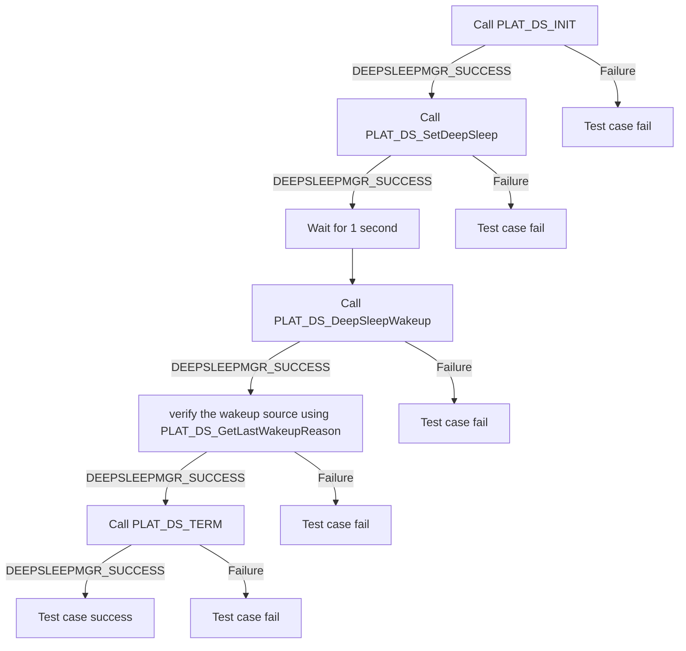

# Deep Sleep Manager L2 Low-Level Test Specification and Procedure Documentation

## Table of Contents

- [Overview](#overview)
- [Acronyms, Terms and Abbreviations](#acronyms-terms-and-abbreviations)
- [Definitions](#definitions)
- [References](#references)
- [Level 2 Test Procedure](#level-2-test-procedure)

## Overview

This document describes the L2 Low-Level Test Specification and Procedure Documentation for the Deep Sleep Manager module.

### Acronyms, Terms and Abbreviations

- `HAL` \- Hardware Abstraction Layer, may include some common components
- `UT`  \- Unit Test(s)
- `OEM`  \- Original Equipment Manufacture
- `SoC`  \- System on a Chip

### Definitions

- `ut-core` \- Common Testing Framework <https://github.com/rdkcentral/ut-core>, which wraps an open-source framework that can be expanded to the requirements for future frameworks.

### References

- `High Level Test Specification` - [DeepSleep Manager High Level TestSpec](deep-sleep-manager_High-Level_TestSpec.md)
- `HAL Interface file` -  [DeepSleep Manager HAL header](https://github.com/rdkcentral/rdk-halif-deepsleep_manager/blob/main/include/deepSleepMgr.h)

## Level 2 Test Procedure

The following functions are expected to test whether the module operates correctly.

### Test 1

|Title|Details|
|--|--|
|Function Name|`test_l2_deepSleepMgr_SetDeepSleepAndVerifyWakeup1`|
|Description|Set the deep sleep with a duration of one second and verify the wake-up source|
|Test Group|02|
|Test Case ID|001|
|Priority|High|

**Pre-Conditions**
None

**Dependencies**
None

**User Interaction**
If the user chooses to run the test in interactive mode, then the test case has to be selected via the console.

#### Test Procedure - Test 1

| Variation / Steps | Description | Test Data | Expected Result | Notes|
| -- | --------- | ---------- | -------------- | ----- |
| 01 | Initialize the deep sleep manager using PLAT_DS_INIT | None | DEEPSLEEPMGR_SUCCESS | Should be successful |
| 02 | Set the deep sleep with a duration of one second using PLAT_DS_SetDeepSleep | deep_sleep_timeout=1, isGPIOWakeup=valid pointer, networkStandby=false | DEEPSLEEPMGR_SUCCESS | Should be successful |
| 03 | PLAT_DS_DeepSleepWakeup shall be called after wakeup to do any postprocessing | None | DEEPSLEEPMGR_SUCCESS | Should be successful |
| 04 | Verify the wakeup source using PLAT_DS_GetLastWakeupReason | wakeupReason = Valid pointer | isGPIOWakeup=false, wakeup reason = DEEPSLEEP_WAKEUPREASON_TIMER | Should be successful |
| 05 | Terminate the deep sleep manager using PLAT_DS_TERM | None | DEEPSLEEPMGR_SUCCESS | Should be successful |

### Test 2

|Title|Details|
|--|--|
|Function Name|`test_l2_deepSleepMgr_SetDeepSleepAndVerifyWakeUp10`|
|Description|Set the deep sleep with a duration of ten seconds and verify the wake-up source|
|Test Group|02|
|Test Case ID|002|
|Priority|High|

**Pre-Conditions**
None

**Dependencies**
None

**User Interaction**
If the user chooses to run the test in interactive mode, then the test case has to be selected via the console.

#### Test Procedure - Test2

| Variation / Steps | Description | Test Data | Expected Result | Notes|
| -- | --------- | ---------- | -------------- | ----- |
| 01 | Initialize the deep sleep manager using PLAT_DS_INIT | None | DEEPSLEEPMGR_SUCCESS | Should be successful |
| 02 | Set the deep sleep with a duration of one second using PLAT_DS_SetDeepSleep | deep_sleep_timeout=10sec, isGPIOWakeup=valid pointer, networkStandby=false | DEEPSLEEPMGR_SUCCESS | Should be successful |
| 03 | PLAT_DS_DeepSleepWakeup shall be called after wakeup to do any postprocessing | None | DEEPSLEEPMGR_SUCCESS | Should be successful |
| 04 | Verify the wakeup source using PLAT_DS_GetLastWakeupReason | wakeupReason = Valid pointer | isGPIOWakeup=false, wakeup reason = DEEPSLEEP_WAKEUPREASON_TIMER | Should be successful |
| 05 | Terminate the deep sleep manager using PLAT_DS_TERM | None | DEEPSLEEPMGR_SUCCESS | Should be successful |

