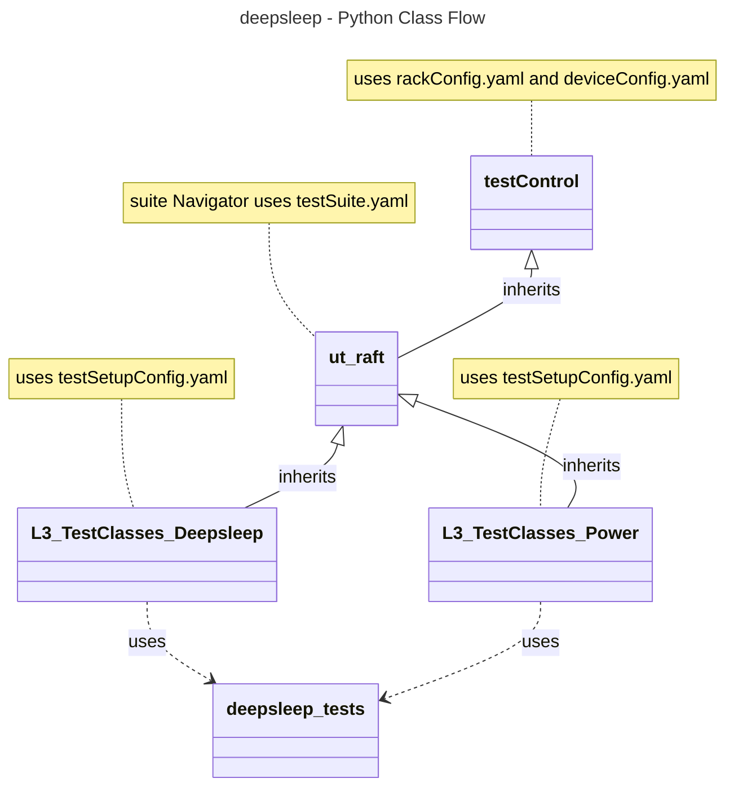

# Deepsleep Manager L3 Low Level Test Specification and Procedure Documentation

## Table of Contents

- [Overview](#overview)
- [Acronyms, Terms and Abbreviations](#acronyms-terms-and-abbreviations)
- [References](#references)
- [Level 3 Test cases High Level Overview](#level-3-test-cases-high-level-overview)
- [Level 3 Python Test](#level-3-python-test-cases-high-level-overview)

## Overview

This document describes the L3 Low Level Test Specification and Procedure Documentation for the Deepsleep Manager module.

### Acronyms, Terms and Abbreviations

- `HAL` \- Hardware Abstraction Layer, may include some common components
- `UT`  \- Unit Test(s)
- `OEM` \- Original Equipment Manufacture
- `SoC` \- System on a Chip
- `LAN` \- Local Area Network
- `Y`   \- yes supported
- `NA`  \- Not Supported

### References

- `High Level Test Specification` - [DeepSleep Manager High Level TestSpec](deep-sleep-manager_High-Level_TestSpec.md)
- `HAL Interface file` -  [DeepSleep Manager HAL header](https://github.com/rdkcentral/rdk-halif-deepsleep_manager/blob/main/include/deepSleepMgr.h)

## Level 3 Test Cases High Level Overview

|#|Test-case|Description|HAL APIs|Source|Sink|
|-|---------|-----------|--------|------|----|
|1|Verify the deepsleep wake up from Voice|Trigger deepsleep, and trigger wake up from voice up source|`PLAT_DS_SetDeepSleep()`|`Y`|`Y`|
|2|Verify the deepsleep wake up from Presence Detection| Trigger deepsleep, and trigger wake up from presence detection|`PLAT_DS_SetDeepSleep()`|`Y`|`Y`|
|3|Verify the deepsleep wake up from Bluetooth| Trigger deepsleep, and trigger wake up from bluetooth|`PLAT_DS_SetDeepSleep()`|`Y`|`Y`|
|4|Verify the deepsleep wake up from wifi| Trigger deepsleep, and trigger wake up from wifi|`PLAT_DS_SetDeepSleep()`|`Y`|`Y`|
|5|Verify the deepsleep wake up from IR| Trigger deepsleep, and trigger wake up from IR|`PLAT_DS_SetDeepSleep()`|`Y`|`Y`|
|6|Verify the deepsleep wake up from Power Key| Trigger deepsleep, and trigger wake up from Power Key|`PLAT_DS_SetDeepSleep()`|`Y`|`Y`|
|7|Verify the deepsleep wake up from CEC| Trigger deepsleep, and trigger wake up from CEC|`PLAT_DS_SetDeepSleep()`|`Y`|`Y`|
|8|Verify the deepsleep wake up from LAN| Trigger deepsleep, and trigger wake up from LAN|`PLAT_DS_SetDeepSleep()`|`Y`|`Y`|

## Level 3 Python Test Cases High Level Overview

The class diagram below illustrates the flow of Deepsleep Manager L3 Python test cases:

- **testControl**
  - Test Control Module for running rack Testing. This module configures the `DUT` based on the rack configuration file provided to the test.
  - This class is defined in `RAFT` framework. For more details refer [RAFT](https://github.com/rdkcentral/python_raft/blob/1.0.0/README.md)
- **ut_raft**
  - Python based testing framework for writing engineering tests.
  - It provides common functionalities like menu navigation, configuration reader, reading user response etc.
  - For more details [ut-raft](https://github.com/rdkcentral/ut-raft).
- **deepsleep manager**
  - This is test helper class which communicates with the `L3` C/C++ test running on the `DUT` through menu
- **L3_TestClasses**
  - These are the L3 test case classes
  - Each class covers the each test use-case defined in [L3 Test use-cases](#level-3-test-cases-high-level-overview) table

### YAML File Inputs

- **rackConfig.yaml**
  - Identifies the rack configuration and platform used
  - References platform-specific config from `deviceConfig.yaml`
  - For more details refer [RAFT](https://github.com/rdkcentral/python_raft/blob/1.0.0/README.md) and [example_rack_config.yml](https://github.com/rdkcentral/python_raft/blob/1.0.0/examples/configs/example_rack_config.yml)

- **deviceConfig.yaml**
  - Specifies overall configuration for the platform
  - Can be overridden by:
    - Changing locally .yaml file directory
    - Using --deviceConfig command line switch
  - For more details refer [RAFT](https://github.com/rdkcentral/python_raft/blob/1.0.0/README.md) and [example_device_config.yml](https://github.com/rdkcentral/python_raft/blob/1.0.0/examples/configs/example_device_config.yml)

- **testSetupConfig.yaml**
  - This configuration file contains the list of requirements for tests to execute. Eg: Copying the streams, setting environment variables etc.
  - Example configuration file [deepsleep_L3_testSetup.yml](../..host/tests/deepsleep_L3_Tests/deepsleep_L3_testSetup.yml)

- **testSuite.yaml**
  - This configuration file contains the list of menu items for C/C++ L3 test running on `DUT`
  - Example configuration file [deepsleep_test_suite.yml](../../host/tests/deepsleepClasses/deepsleep_test_suite.yml)