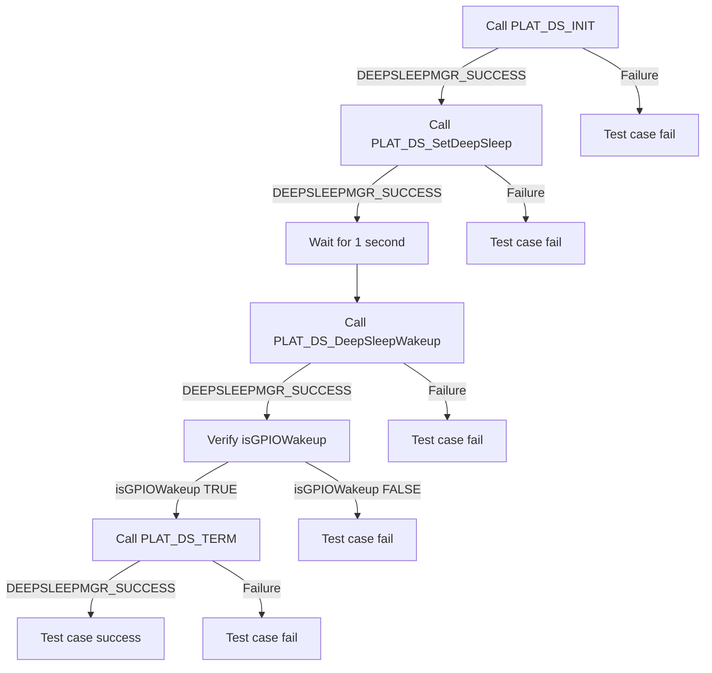
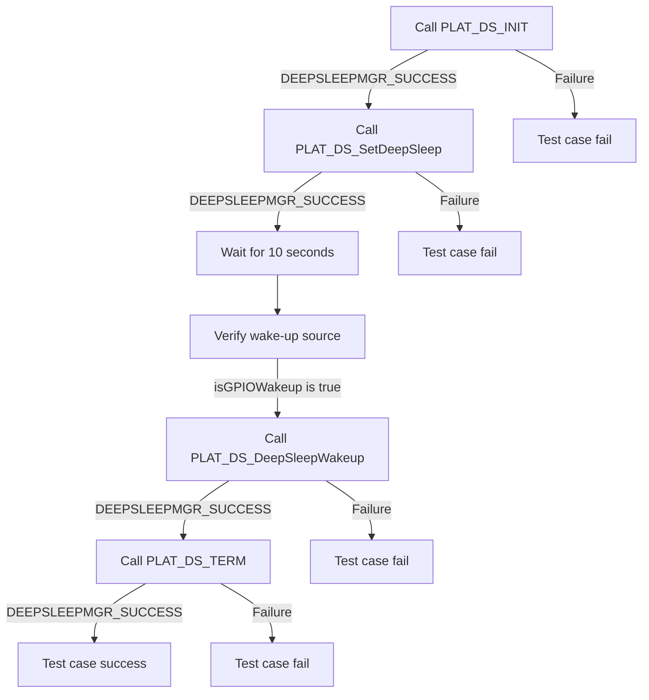

# DEEPSLEEPMGR L2 Low Level Test Specification and Procedure Documentation

## Table of Contents

- [DEEPSLEEPMGR L2 Low Level Test Specification and Procedure Documentation](#deepsleepmgr-l2-low-level-test-specification-and-procedure-documentation)

  - [Table of Contents](#table-of-contents)
  - [Overview](#overview)
    - [Acronyms, Terms and Abbreviations](#acronyms-terms-and-abbreviations)
    - [Definitions](#definitions)
    - [References](#references)
  - [Level 2 Test Procedure](#level-2-test-procedure)

## Overview

This document describes the level 2 testing suite for the DEEPSLEEPMGR module.

### Acronyms, Terms and Abbreviations

- `HAL` \- Hardware Abstraction Layer, may include some common components
- `UT`  \- Unit Test(s)
- `OEM`  \- Original Equipment Manufacture
- `SoC`  \- System on a Chip

### Definitions

  - `ut-core` \- Common Testing Framework <https://github.com/rdkcentral/ut-core>, which wraps a open-source framework that can be expanded to the requirements for future framework.

### References
- `High Level Test Specification` - [deepsleep-manager_TestSpec.md](deepsleep-manager_TestSpec.md)

## Level 2 Test Procedure

The following functions are expecting to test the module operates correctly.

### Test 1

|Title|Details|
|--|--|
|Function Name|`test_l2_deepSleepMgr_SetDeepSleepAndVerifyWakeup1`|
|Description|Set the deep sleep with a duration of one second and verify the wake-up source|
|Test Group|Module : 02|
|Test Case ID|001|
|Priority|High|

**Pre-Conditions :**
None

**Dependencies :**
None

**User Interaction :**
If user chose to run the test in interactive mode, then the test case has to be selected via console.

#### Test Procedure :

| Variation / Steps | Description | Test Data | Expected Result | Notes|
| -- | --------- | ---------- | -------------- | ----- |
| 01 | Initialize the deep sleep manager using PLAT_DS_INIT | None | DEEPSLEEPMGR_SUCCESS | Should be successful |
| 02 | Set the deep sleep with a duration of one second and enable GPIO wakeup using PLAT_DS_SetDeepSleep | deep_sleep_timeout=1, isGPIOWakeup=TRUE, networkStandby=FALSE | DEEPSLEEPMGR_SUCCESS | Should be successful |
| 03 | Sleep for one second | None | None | None |
| 04 | Wake up from deep sleep using PLAT_DS_DeepSleepWakeup | None | DEEPSLEEPMGR_SUCCESS | Should be successful |
| 05 | Verify that the wakeup source is GPIO | isGPIOWakeup=true | true | Should be successful |
| 06 | Terminate the deep sleep manager using PLAT_DS_TERM | None | DEEPSLEEPMGR_SUCCESS | Should be successful |

### Test 2

|Title|Details|
|--|--|
|Function Name|`test_l2_deepSleepMgr_SetDeepSleepAndVerifyWakeUp10`|
|Description|Set the deep sleep with a duration of ten seconds and verify the wake-up source|
|Test Group|Module : 02|
|Test Case ID|002|
|Priority|High|

**Pre-Conditions :**
None

**Dependencies :**
None

**User Interaction :**
If user chose to run the test in interactive mode, then the test case has to be selected via console.

#### Test Procedure :

| Variation / Steps | Description | Test Data | Expected Result | Notes|
| -- | --------- | ---------- | -------------- | ----- |
| 01 | Initialize the platform deep sleep manager using PLAT_DS_INIT | None | DEEPSLEEPMGR_SUCCESS | Should be successful |
| 02 | Set the deep sleep with a duration of ten seconds using PLAT_DS_SetDeepSleep | deep_sleep_timeout = 10, isGPIOWakeup = valid pointer, networkStandby = true | DEEPSLEEPMGR_SUCCESS | Should be successful |
| 03 | Sleep for ten seconds | None | None | None |
| 04 | Check the wake-up source | None | None | None |
| 05 | Wake up from deep sleep using PLAT_DS_DeepSleepWakeup | None | DEEPSLEEPMGR_SUCCESS | Should be successful |
| 06 | Terminate the platform deep sleep manager using PLAT_DS_TERM | None | DEEPSLEEPMGR_SUCCESS | Should be successful |

