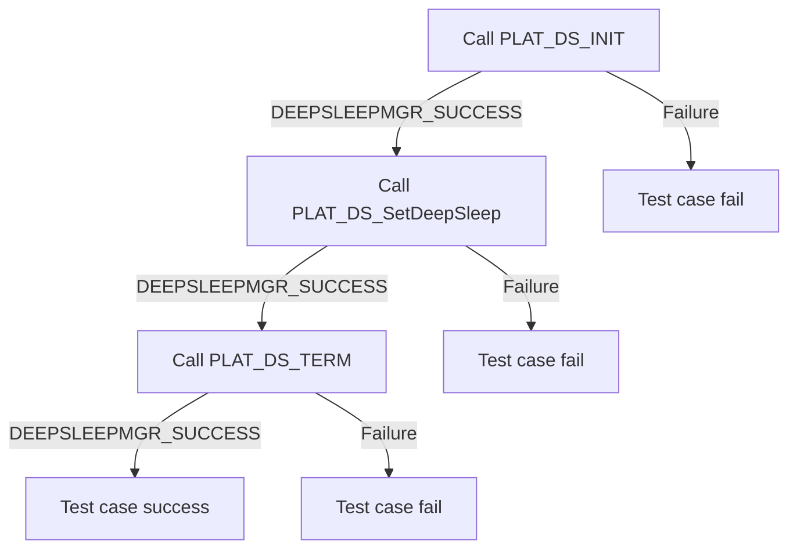
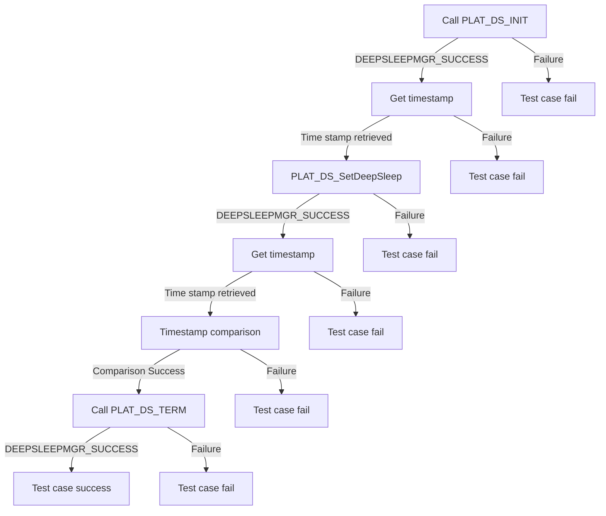

# HDMI CEC DRIVER Level 2 - Module Testing

| Version | Date(YY-MM-DD) | Comments |
| -------| ----- |  ----- |
| 1.0.0 | 15/05/24 | Inital Document |

## Table of Contents

- [HDMI CEC DRIVER Level 2 - Module Testing](#hdmi-cec-driver-level-2---module-testing)
  - [History](#history)
  - [Table of Contents](#table-of-contents)
  - [Overview](#overview)
    - [Acronyms, Terms and Abbreviations](#acronyms-terms-and-abbreviations)
    - [Definitions](#definitions)
    - [References](#references)
  - [Level 2 Test Suite](#level-2-test-suite)

## Overview

This document describes the level 2 testing suite for the HDMI CEC DRIVER module.

### Acronyms, Terms and Abbreviations

- `HAL` \- Hardware Abstraction Layer, may include some common components
- `HAL.h`  \- Abstracted defined API to control the hardware
- `HAL.c`  \- Implementation wrapper layer created by the `OEM` or `SoC` Vendor.
- `RDK`  \- Reference Design Kit for All Devices
- `RDK-B`  \- Reference Design Kit for Broadband Devices
- `RDK-V`  \- Reference Design Kit for Video Devices
- `UT`  \- Unit Test(s)
- `OEM`  \- Original Equipment Manufacture
- `SoC`  \- System on a Chip

### Definitions

- `Soc Vendor` \- Definition to encompass multiple vendors
- `Unit Tests` \- C Function tests that run on the target hardware
- `Common Testing Framework` \- Off the shelf 3rd Party Testing Framework, or framework that does not require infrastructure to control it. That's not to say it cannot be controlled via infrastructure if required. Examples of which are.
  - `GTest` \- Google Test Suit <https://google.github.io/googletest>
  - `CUnit` \- C Testing Suit <http://cunit.sourceforge.net/>
  - `Unity` \- C Embedded Testing Suit <http://www.throwtheswitch.org/unity>
  - `ut-core` \- Common Testing Framework <https://github.com/rdkcentral/ut-core>, which wraps a open-source framework that can be expanded to the requirements for future framework.

### References

- `Feedback Loops` \- <https://www.softwaretestingnews.co.uk/4-methods-to-improve-your-feedback-loops-and-supercharge-your-testing-process/>
- `Doxygen` \- SourceCode documentation tool - <https://www.doxygen.nl/index.html>
- `Black Box Testing` \- <https://en.wikipedia.org/wiki/Black-box_testing>

## Level 2 Test Suite

The following functions are expecting to test the module operates correctly.

### Test 1

|Title|Details|
|--|--|
|Function Name|`test_l2_deep_sleep_SetDeepSleepWithTimeout`|
|Description|Sets the device into deep-sleep for a specified amount of time.|
|Test Group|Module : 02|
|Test Case ID|001|
|Priority|High|

**Pre-Conditions :**
None

**Dependencies :**
None

**User Interaction :**
If user chose to run the test in interactive mode, then the test case has to be selected via console.

#### Test Procedure :

| Variation / Steps | Description | Test Data | Expected Result | Notes|
| -- | --------- | ---------- | -------------- | ----- |
| 01 | Initialize the DeepSleep HAL using PLAT_DS_INIT() | `N/A` | DEEPSLEEPMGR_SUCCESS | Should be successful |
| 02 | Call PLAT_DS_SetDeepSleep() | deep_sleep_timeout = valid number, *isGPIOWakeup = valid pointer, networkStandby = true/false | DEEPSLEEPMGR_SUCCESS | Should be successful, and device should wake up after the specified time has passed |
| 03 | Uninitialize the DeepSleep HAL using PLAT_DS_TERM() | `N/A` | DEEPSLEEPMGR_SUCCESS | Should be successful |

### Test 2

|Title|Details|
|--|--|
|Function Name|`test_l2_deep_sleep_SetDeepSleepWithTimeoutTiming`|
|Description|Sets the device into deep-sleep for a specified amount of time.|
|Test Group|Module : 02|
|Test Case ID|002|
|Priority|High|

**Pre-Conditions :**
None

**Dependencies :**
None

**User Interaction :**
If user chose to run the test in interactive mode, then the test case has to be selected via console.

#### Test Procedure :

| Variation / Steps | Description | Test Data | Expected Result | Notes|
| -- | --------- | ---------- | -------------- | ----- |
| 01 | Initialize the DeepSleep HAL using PLAT_DS_INIT() | `N/A` | DEEPSLEEPMGR_SUCCESS | Should be successful |
| 02 | Get timestamp, using time(NULL) | `N/A` | Current time | Should be successful |
| 03 | Call PLAT_DS_SetDeepSleep() | deep_sleep_timeout = valid number, *isGPIOWakeup = valid pointer, networkStandby = true/false | DEEPSLEEPMGR_SUCCESS | Should be successful, and device should wake up after the specified time has passed |
| 04 | Get timestamp, using time(NULL) | `N/A` | Current time | Should be successful |
| 05 | Compare timestamps from steps 02 and 04 | `N/A` | The difference should be within expected bounds | Should be successful |
| 06 | Uninitialize the DeepSleep HAL using PLAT_DS_TERM() | `N/A` | DEEPSLEEPMGR_SUCCESS | Should be successful |

